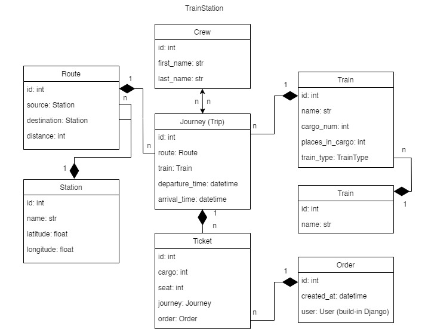

# Train Station API
The Train Station API application implements a system that allows travelers to easily book tickets for upcoming train journeys.

# Installation

- git clone https://github.com/MaxymChyncha/train-station-api
- cd train-station-api
- python -m venv venv
- venv\Scripts\activate for MacOS/Linux: source venv/bin/activate
- pip install -r requirements.txt
- python manage.py migrate 
- python manage.py runserver

# Run with Docker

Please install Docker

- docker-compose build
- docker-compose up

# Features

- JWT Authentication
- Admin panel (/admin/)
- Documentation (located at api/schema/swagger-ui/)
- Managing Orders and Tickets
- Creating Routes with Stations
- Creating Journey, Crews, Trains, Train Types
- Filtering Routes and Journey using different parameters
- Cover all custom logic with tests

# Getting access
You can use the following credentials:

- Email: admin@train.com
- Password: test12345

# Database Structure

You can also register a new user. After receiving the authentication token, 
all endpoints provided by the API will be available to you.

